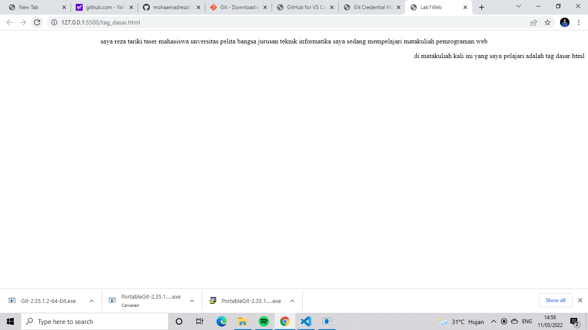
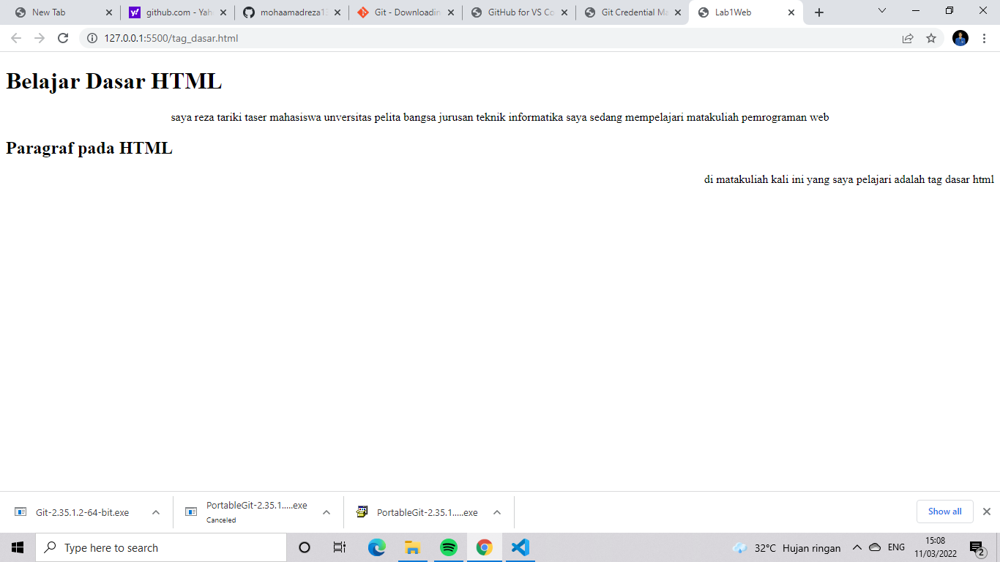

**LAB1WEB**
| Reza Tariki Taser | 312010265   |
| ----------------- | ----------- |
| TI.20.A.2         | Pemrograman |

***Paragraf***

ini adalah contoh dari tag paragraf dengan penjelasan kode tag (p) berfungsi untuk menaruh kalimat apapun dan di dalam tag paragraf atau (p) anda bisa menambahkan atribut (align)

**Heading**

Heading adalah judul artikel, (h1) adalah heading atau judul terbesar sementara (h6) yang kecil heading biasa digunakan untuk judul dan standar nya adalah (h1) atau (h2)
